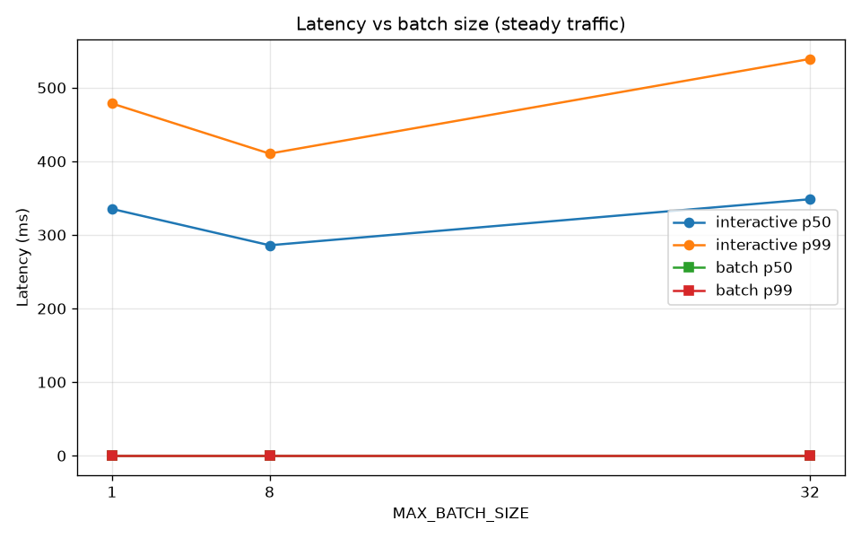
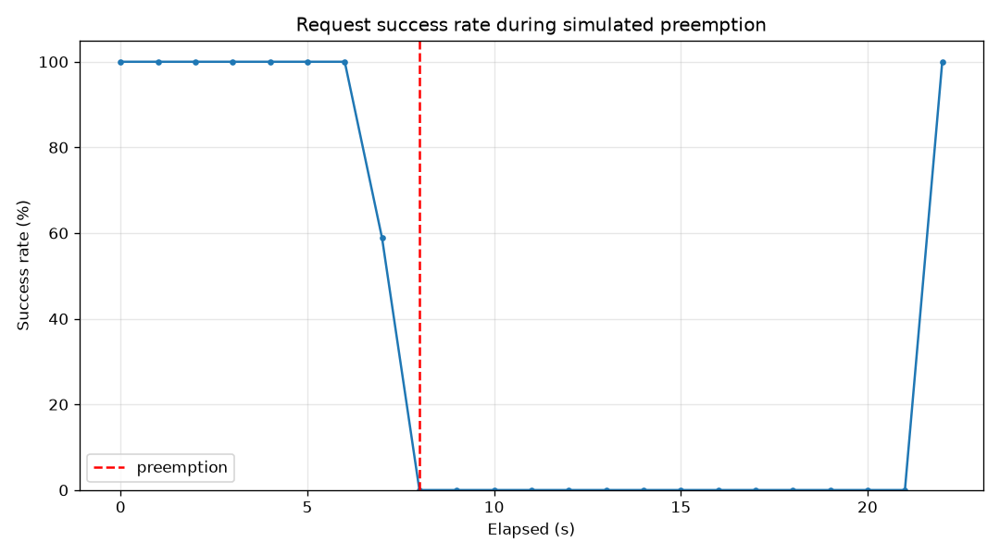
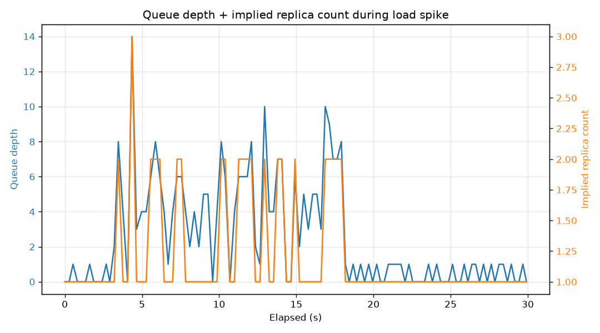

# Resilient Inference Server

A production-pattern **GPU/CPU inference serving** demo built in incremental phases — the same concerns addressed by [Vertex AI Prediction](https://cloud.google.com/vertex-ai/docs/predictions/overview) and [GKE Inference](https://cloud.google.com/kubernetes-engine/docs/concepts/about-gke-inference-gateway): dynamic batching, SLA-aware request scheduling, queue-depth autoscaling, Spot/on-demand cost routing, and graceful Spot preemption drain. Runs locally on CPU (PyTorch), deploys to **kind** or **GKE**, and ships reproducible benchmarks with published numbers.

---

## Architecture

```
                    ┌─────────────────────────────────────┐
                    │  Client / Locust / benchmarks       │
                    └──────────────────┬──────────────────┘
                                       │ POST /predict
                                       ▼
                    ┌─────────────────────────────────────┐
                    │  resilient-inference-router         │
                    │  (queue-depth weighted routing)     │
                    │  Spot 9:1 when idle, on-demand 9:1  │
                    │  when queue_depth ≥ 5               │
                    └────────────┬───────────────┬────────┘
                                 │               │
              ┌──────────────────┘               └──────────────────┐
              ▼                                                      ▼
┌─────────────────────────────┐                    ┌─────────────────────────────┐
│  Spot pool (preemptible)    │                    │  On-demand pool (stable)    │
│  deployment-spot.yaml       │                    │  deployment-ondemand.yaml   │
│  preStop → /internal/drain  │                    │  PEER_URLS migration target │
└──────────────┬──────────────┘                    └──────────────┬──────────────┘
               │                                                   │
               └─────────────────────┬─────────────────────────────┘
                                     ▼
                    ┌─────────────────────────────────────┐
                    │  Inference pod                      │
                    │  FastAPI + asyncio batching sched   │
                    │  DistilBERT (classify) / distilgpt2 │
                    │  /metrics → Prometheus + HPA        │
                    └─────────────────────────────────────┘
```

Full design rationale (with benchmark numbers): [`docs/architecture.md`](docs/architecture.md).

---

## Quickstart (local)

### Virtual environment

```bash
python -m venv .venv
source .venv/bin/activate          # Windows: .venv\Scripts\activate
pip install -r requirements.txt
python -m server.main --port 8000
curl http://localhost:8000/healthz
curl -X POST http://localhost:8000/predict \
  -H "Content-Type: application/json" \
  -d '{"text": "I love this product", "priority": "interactive"}'
```

Generative mode: `python -m server.main --generative` → `POST /generate`.

### Docker

```bash
docker build -t resilient-inference-server:latest .
docker run --rm -p 8000:8000 resilient-inference-server:latest
```

### kind (local Kubernetes)

**Windows (PowerShell):**

```powershell
.\k8s\scripts\deploy-kind.ps1
kubectl port-forward svc/resilient-inference-server 8000:80
curl http://localhost:8000/healthz
```

**Linux/macOS:**

```bash
docker build -t resilient-inference-server:latest .
kind create cluster --name resilient-inf --config k8s/kind/cluster-config.yaml
kind load docker-image resilient-inference-server:latest --name resilient-inf
kubectl apply -f k8s/service-ondemand.yaml -f k8s/service-spot.yaml \
  -f k8s/deployment-ondemand.yaml -f k8s/deployment-spot.yaml \
  -f k8s/deployment-router.yaml -f k8s/service.yaml -f k8s/hpa.yaml
kubectl wait --for=condition=ready pod -l app=resilient-inference-server --timeout=180s
kubectl port-forward svc/resilient-inference-server 8000:80
```

Teardown: `kind delete cluster --name resilient-inf`

---

## Deploy to GKE

Requires a GCP project with billing.

```bash
# 1. Cluster + on-demand baseline pool
gcloud container clusters create resilient-inf \
  --zone us-central1-a --num-nodes 1 --machine-type e2-standard-4 \
  --node-labels node-pool=ondemand

# 2. GPU on-demand pool (create BEFORE Spot GPU)
gcloud container node-pools create gpu-ondemand \
  --cluster resilient-inf --zone us-central1-a \
  --machine-type n1-standard-4 \
  --accelerator type=nvidia-tesla-t4,count=1 --num-nodes 1 \
  --node-labels node-pool=ondemand \
  --node-taints nvidia.com/gpu=present:NoSchedule

# 3. Spot GPU burst pool
gcloud container node-pools create gpu-spot \
  --cluster resilient-inf --zone us-central1-a --spot \
  --machine-type n1-standard-4 \
  --accelerator type=nvidia-tesla-t4,count=1 --num-nodes 1 \
  --node-labels cloud.google.com/gke-spot=true,node-pool=spot \
  --node-taints cloud.google.com/gke-spot=true:NoSchedule,nvidia.com/gpu=present:NoSchedule

# 4. Push image & deploy (set PROJECT_ID; uncomment GPU limits in k8s/*.yaml)
docker tag resilient-inference-server:latest \
  us-central1-docker.pkg.dev/PROJECT_ID/resilient-inf/server:latest
docker push us-central1-docker.pkg.dev/PROJECT_ID/resilient-inf/server:latest

kubectl apply -f k8s/service-ondemand.yaml -f k8s/service-spot.yaml \
  -f k8s/deployment-ondemand.yaml -f k8s/deployment-spot.yaml \
  -f k8s/deployment-router.yaml -f k8s/service.yaml -f k8s/hpa.yaml

# 5. Custom-metric HPA (queue_depth) — see k8s/prometheus-adapter/README.md
```

---

## Simulated Spot preemption / drain demo

**Local (two processes + load):**

```bash
# Terminal 1 — stable peer
python -m server.main --port 8001

# Terminal 2 — Spot instance with simulated preemption
PEER_URLS=http://127.0.0.1:8001 \
SIMULATE_PREEMPTION_AFTER_SECONDS=15 \
DRAIN_EXIT_ON_COMPLETE=0 \
python -m server.main --port 8000

# Terminal 3 — sustained load + metrics
python -m benchmarks.run_full_suite --fast   # includes preemption scenario
# Or Locust: LOCUST_SHAPE=preemption locust -f load_test/locustfile.py --host http://127.0.0.1:8000
```

**What to observe:**

- JSON logs: `drain_state_transition` → `pending_queue_migrated` → `drain_orchestration_complete`
- `/metrics`: `requests_dropped_total` stays **0**; `requests_migrated_total` increases
- New requests to draining pod: **503** + `Retry-After` (clients should retry peers)

**On kind/GKE:** delete a Spot pod or rely on `preStop` hook — same drain path as GCE metadata.

---

## Key benchmark results (Phase 8)

Run the suite: `python -m benchmarks.run_full_suite` (full) or `--fast` (~5 min).  
Raw CSVs and graphs: `benchmarks/output/`.

### Latency vs batch size

At **MAX_BATCH_SIZE=8**, steady throughput peaks at **53.7 req/s** with interactive p50 **286 ms** (vs **335 ms** at batch size 1).



### Preemption: zero dropped requests

During **3,043** requests over 22 s with preemption at **t=8 s**: `requests_dropped_total = 0`. Success rate drops on the primary while it drains (503 responses); queued work migrates to the peer.



### Autoscaling signal

Bursty spike drives **queue_depth** to **14**; implied replica count (HPA target 5/pod) scales to **3** within ~4 s, then recovers.



| Scenario | Throughput | Interactive p50 | Est. $/1k inferences |
|----------|------------|-----------------|----------------------|
| Steady, batch=8 | 53.7 req/s | 286 ms | $0.000099 |
| Bursty, batch=8 | 24.0 req/s | 47 ms | $0.000223 |
| Bursty, batch=1 | 23.2 req/s | 56 ms | $0.000231 |

Pricing constants (Spot 0.30× on-demand): [`benchmarks/pricing.py`](benchmarks/pricing.py).

---

## What's simplified vs production (vLLM, Vertex, TensorRT-LLM)

| Area | Production | This repo |
|------|------------|-----------|
| **Attention / KV cache** | PagedAttention, block tables | Full-sequence re-pad each step |
| **Kernels** | CUDA graphs, fused attention | Stock PyTorch |
| **Batching** | Iteration-level continuous batching at scale | Async slot pool (generative) or static batch window (classify) |
| **Model serving** | Multi-LoRA, multi-model routing | Single model per process |
| **Autoscaling** | Multi-signal (GPU SM%, queue, latency SLO) | `queue_depth` HPA + router weights |
| **Preemption** | Checkpoint/resume, global scheduler | Drain + peer forward of **queued** work only |
| **Security** | IAM, VPC-SC, encryption | Open `/predict` (demo) |

We intentionally implement **scheduling and reliability patterns**, not kernel-level optimization — enough to show how GKE/Vertex-style infrastructure behaves under load and Spot preemption.

---

## What I'd build next

1. **PagedAttention-style KV-cache blocks** — stop re-computing full prefix each decode step; integrate with slot pool scheduler.
2. **Multi-model serving** — model ID routing, LoRA adapter hot-swap, separate GPU memory pools.
3. **TPU / multi-GPU** — `torch_xla` or vLLM tensor parallel; autoscaling on TPU pod slices.
4. **Production ingress** — GKE Inference Gateway, auth (IAP), and SLO-based autoscaling on `request_latency_seconds` p99.
5. **Real preemption recovery** — in-flight sequence checkpoint to CPU RAM and resume on peer (generative mode).

---

## Project layout

```
server/           Inference API, batching, drain, router, metrics
k8s/              GKE/kind manifests, Prometheus Adapter config
load_test/        Locust scenarios (steady / bursty / preemption shapes)
benchmarks/       Benchmark suite, pricing model, output graphs
docs/             Architecture (Google Cloud Framework pillars)
tests/            21 pytest tests
```

## Development phases (git history)

| Phase | Focus |
|-------|--------|
| 0–2 | Skeleton, DistilBERT classify, static dynamic batching |
| 3 | SLA-aware interactive/batch priority scheduling |
| 4 | Continuous slot batching (generative / distilgpt2) |
| 5 | Docker + Kubernetes (kind/GKE) |
| 6 | Spot preemption graceful drain + peer migration |
| 7 | Queue-depth metrics, custom-metric HPA, Spot/on-demand router |
| 8 | Locust load tests, benchmark suite, quantitative docs |

```bash
pytest tests/ -q
python -m benchmarks.run_full_suite --fast
```
